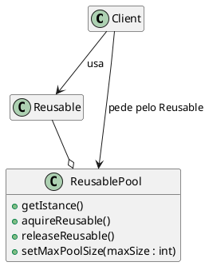
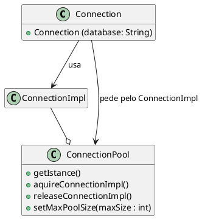

# Object Pool

[^GAMMA]

## Intenção

O Object Pool tem o objetivo de trazer um aumento significativo no desempenho, ele reduz o tempo e custo das instanciações, reaproveitando objetos, e melhorando a performance e o controle sobre os recursos.

## Também conhecido como

Pool de Objetos

## Motivação

Às vezes, o desempenho pode ser o principal problema durante o desenvolvimento do software, e a criação do objeto (instanciação da classe) é uma etapa cara. Enquanto o padrão Prototype ajuda a melhorar o desempenho clonando os objetos, o padrão Object Pool oferece um mecanismo para reutilizar objetos que são caros para criar.

Os clientes de um pull de objeto se "sentem" como proprietários de um serviço, embora o serviço seja compartilhado entre muitos outros clientes.

## Aplicabilidade

Use o padrão Object Pool quando:

- Possuir objetos com alto custo e/ou tempo de criação;
- Os objetos que estão sendo usados poderem ser reaproveitados;
- Os objetos forem intânciados com muita frequência, ou seja, várias partes do seu aplicativo requerem os mesmos objetos em momentos diferentes.


## Estrutura

<figure>



<figcaption>Estrutura Object Pool.</figcaption>
</figure>


## Participantes 

- **Reusable**
    - Instâncias dessa classe colaboram com outros objetos por um período de tempo limitado, onde serão compartilhados por vários clientes por um período de tempo limitado e então não são mais necessárias para essa colaboração
- **Client**
    - Instâncias dessa classe usam os obejtos reutilizaveis (Reusable Objects).
- **ReusablePool**
    - Instâncias dessa classes gerenciam os objetos             reutilizáveis ​​para utilização pelos clientes, criando e manuseando uma pool de objetos.
    

## Colaborações

<!-- - Strategy e Context interagem para implementar o algoritmo escolhido. Um contexto pode passar todos os dados requeridos pelo algoritmo para a estratégia quando o algoritmo é chamado. Alternativamente, o contexto pode passar a si próprio como argumento para operações de Strategy. Isto permite à estratégia chamar de volta o contexto conforme requerido.
- Um contexto repassa solicitações dos seus clientes para sua estratégia. Os clientes usualmente criam e passam um objeto Concrete Strategy para o contexto; após isso, interagem exclusivamente com o contexto. Freqüentemente existe uma família de classes Concrete Strategy para um cliente fazer sua escolha. -->

## Consequências

O padrão Object Pool tem os seguintes benefícios e desvantagens:

- **Benefícios**
    
    - Oferece um aumento no desempenho.
    - Consegue gerenciar as conexões e fornece uma maneira de reutiliza-las e compartilha-las.
    - Pode fornecer o limite para o número máximo de objetos que podem ser criados.
    - É mais eficaz em uma situação em que a taxa de inicialização de uma instância de classe é alta.

- **Desvantagens** 

    - Como existe um limite de objetos na pool, pode ocorrer falta de objetos disponiveis.
    - Para que o objeto volte para a pool, o cliente que o estava utilizando, precisa libera-lo, caso não o faça o objeto será perdido e não voltará para a pool.
    - Pode ocorrer falhas na politica de aquisição e criação dos recursos.

## Implementação

A implementação envolve os objetos citados nos participantes:

1. Reusable
2. Client
3. ReusablePool

Quando um cliente solicita um objeto reutilizável, o pool executa as seguintes ações:
- Procurar um objeto Reutilizável disponível e caso seja encontrado será devolvido ao cliente.
- Se nenhum objeto reutilizável foi encontrado, ele tenta criar um novo. Se esta ação for bem-sucedida, o novo objeto reutilizável será retornado ao cliente.
- Se o pool não conseguiu criar um novo Reutilizável, o pool aguardará até que um objeto reutilizável seja liberado.

O cliente é responsável por solicitar o objeto reutilizável, bem como liberá-lo para o pool. Caso esta ação não seja realizada o objeto reutilizável será perdido, sendo considerado indisponível pelo ResourcePool.

Os clientes não sabem que estão compartilhando o objeto reutilizável. Do ponto de vista do cliente, eles são os proprietários de um novo objeto que vem da pool de recursos, da mesma forma que vem de uma fábrica ou outro padrão de design criacional. A única diferença é que o cliente deverá marcar o objeto reutilizável como disponível após terminar de utilizá-lo.

Por exemplo se trabalhamos com bancos de dados, quando uma conexão é fechada ela não é necessariamente destruída, ela pode ser reutilizada por outro cliente, já que abrir muitas conexões pode afetar o desempenho por vários motivos, como levar mais tempo para criar uma nova e com isso sobrecarregar o banco de dados, e também que criar uma conexão é uma operação cara.

<figure>


</figure>

**Connection** - Representa o objeto que é instanciado pelo cliente. Da perspectiva do cliente, este objeto é instanciado e manipula as operações do banco de dados, é o único objeto visível para o cliente. O cliente não sabe que usa algumas conexões compartilhadas.

**ConnectionImpl** - É o objeto que implementa as operações de banco de dados que são expostas por Connection para o cliente.

**ConnectionPool** - É o que gerencia as conexões com o banco de dados. Ele mantém uma lista de objetos ConnectionImpl e instancia novos objetos, se necessário.

Quando o cliente precisa consultar o banco de dados, ele instancia um novo objeto Connection especificando o nome do banco de dados e chama o método de consulta que retorna um conjunto de registros.

## Exemplo de código

<!-- Daremos o código de alto nível para o exemplo da seção Motivação, o qual está baseado na implementação das classes Composition e Compositor em Inter Views [LCI+92].

A classe Composition mantém uma coleção de Component, a qual representa texto e elementos gráficos num documento. Uma composição arruma os objetos componentes em linhas usando uma instância da subclasse Compositor, a qual encapsula uma estratégia de quebra de linhas. Cada componente tem associados um tamanho natural, uma extensibilidade e uma compressibilidade. A extensibilidade define quanto o componente pode crescer além do seu tamanho natural;compressibilidade é quanto ele pode ser comprimido. A composição passa esses valores para um compositor, o qual os utiliza para determinar a melhor localização para quebras de linha.

```java
public class Composition {
    private Compositor compositor;
    private List<Component> components;// a lista de componentes
    private int componentCount; // o número de componentes
    private int lineWidth; // largura da linha
    private int lineBreaks: // posição das quebras das linhas em componentes
    private int lineCount; // número de linhas

    public Composition (Compositor compositor){
        this.compositor = compositor;
    }
    void repair(){}
}
```
Quando um novo layout é requerido, a composição solicita ao seu compositor determinar onde colocar as quebras de linha. A composição passa para o compositor três vetores que definem tamanhos naturais, extensibilidades e compressibilidades dos componentes. Ela também passa o número de componentes, a largura da linha e um vetor que o compositor preenche com a posição de cada quebra de linha. O compositor devolve o número de quebras calculadas.

A interface de Compositor permite à composição passar ao compositor toda a informação de que ele necessita. Isso é um exemplo da abordagem do tipo "levando os dados para a estratégia":

```java
public interface Compositor {
public int compose(Coord natural[], Coord stretch[], Coord shrink[], int componentCount, int lineWidth, int breaks[]);
```
Note que compositor é uma classe abstrata (ou interface). As subclasses concretas definem estratégias específicas de quebras de linha.

A composição chama a operação *repair* do seu compositor. *repair* primeiramente inicia vetores com tamanho, extensibilidade e compressibilidade naturais de cada componente (cujos detalhes omitiremos). Então, ela chama o compositor para obter as quebras de linha e finalmente estabelece o layout dos componentes de acordo com as quebras (também omitido):
```java
void repair(){
    Coord[] natural;
    Coord[] stretchability:
    Coord[] shrinkability;
    int componentCount;
    int[] breaks;
    // prepara os arrays com os tamanhos desejados dos componentes
    //...
    // determina onde estão as quebras:
    int breakCount;
    breakCount = compositor.compose(natural, stretchability, shrinkability,componentCount, this.lineWidth, breaks);
    // dispõe os componentes de acordo com as quebras
}
```
Examinemos agora as subclasses de Compositor. A classe SimpleCompositor examina componentes uma linha por vez para determinar onde as quebras deveriam ser colocadas:

```java
public class SimpleCompositor implements Compositor{
    public SimpleCompositor{
    }
    public int compose(Coord natural[], Coord stretch[], Coord shrink[], int componentCount, int lineWidth, int breaks[]){
        //...    
    };
};
```

O *TexCompositor* utiliza uma estratégia mais global. Ele examina um parágrafo por vez, levando em conta o tamanho dos componentes e sua extensibilidade. Ele também tenta dar um "aspecto" uniforme ao parágrafo através da minimização dos espaços em branco entre componentes.

```java
public class TexCompositor implements Compositor{
    public TexCompositor{
    }
    public int compose(Coord natural[], Coord stretch[], Coord shrink[], int componentCount, int lineWidth, int breaks[]){
        //...    
    };
};
```

ArrayCompositor quebra os componentes em linhas a intervalos regulares.

```java
public class ArrayCompositor implements Compositor{
    public ArrayCompositor{
    }
    public int compose(Coord natural[], Coord stretch[], Coord shrink[], int componentCount, int lineWidth, int breaks[]){
        //...    
    };
};
```

Essas classes não utilizam toda a informação passada em `Compose`. O `SimpleCompositor` ignora a extensibilidade dos componentes, levando em conta somente suas larguras naturais. O `TeXCompositor` utiliza toda a informação passada para ela, enquanto que `ArrayCompositor` ignora todas.

Para instanciar composition, você passa a ela o compositor que deseja usar:
```java
Composition quick = new Composition (new SimpleCompositor());
Composition slick = new Composition (new TexCompositor());
Composition iconic = new Composition (new ArrayCompositor (100));
```

A interface de Compositor é cuidadosamente projetada para suportar todos os algoritmos de layout que as subclasses possam implementar. Você não deseja ter que mudar esta interface a cada nova subclasse introduzida porque isso exigirá mudar subclasses existentes. Em geral, as interfaces de Strategy eContext determinam também qual padrão consegue o seu intento. -->

## Usos conhecidos

<!-- Tanto ET++ [WGM88] como InterViews usam estratégias para encapsular diferentes algoritmos de quebras de linhas na forma como descrevemos.

No sistema RTL destinado a otimização de código gerado por compiladores [JML92], estratégias definem diferentes esquemas de alocação de registradores (Register Allocator) e procedimentos de utilização (scheduling) do conjunto de instruções (RISCscheduler, CISCscheduler). Isso fornece flexibilidade no direcionamento do otimizador para diferentes arquiteturas de máquina.

O framework para calculadoras *(calculation engine)* do SwapsManager de ET++ computa preços para diferentes instrumentos financeiros [EG92]. Suas abstrações-chave são Instrumente YieldCurve (instrumento e curva de rendimentos, respectivamente). Diferentes instrumentos são implementados como subclasses de Instrument. YieldCurve calcula coeficientes de desconto que determinam o valor presente de fluxos de caixa futuros. Ambas as classes delegam algum comportamento para objetos Strategy. O framework fornece uma família de classes Concrete Strategy para gerar fluxos de caixa, avaliar permutas (swaps) e calcular coeficientes de desconto. Você pode criar novas calculadoras através da configuração de Instrument e YieldCurve com diferentes objetos Concrete Strategy. Esta abordagem suporta a combinação e casamento de implementações existentes de Strategy, bem como a definição de novas implementações.

Os componentes de Booch usam estratégias como argumentos-template. As classes de coleção de Booch suportam três tipos diferentes de estratégias de alocação de memória: administrada (alocação dentro de um pool), controlada (alocações/ desalocações são protegidas por travamentos (locks), e não-administradas (o alocador de memória normal). Essas estratégias são passadas como argumentos-template para uma classe de coleção quando ela é instanciada. Por exemplo, uma Unbounded- Collection que usa a estratégia não-administrada é instanciada como UnboundedCollection<MyItemType*, Unnanaged>,

RApp é um sistema para o layout de circuitos integrados [GA89,AG90]. RAPP deve estabelecer o layout e as rotas dos condutores que conectam subsistemas do circuito. Algoritmos para determinação de rotas no RApp são definidos como subclasses de uma classe abstrata Router. A Router é uma classe Strategy.

ObjectWindows da Borland [Bor94] utiliza estratégias em caixas de diálogo para assegurar que os usuários forneçam dados válidos. Por exemplo, os números devem estar em um certo intervalo, e um campo de entrada numérica deve aceitar somente dígitos. Validar que uma string está correta pode exigir uma pesquisa numa tabela

ObjectWindows utiliza objetos Validator para encapsular estratégias de validação. Validators são exemplos de objetos Strategy. Campos de entrada de dados delegam a estratégia de validação para um objeto Validator opcional. O cliente associa um validator a um campo, se for necessária uma validação (isto é, um exemplo de uma estratégia opcional). Quando o diálogo é fechado, os campos de entrada solicitam aos seus validators para validarem os dados. A biblioteca de classes fornece validators para casos comuns, tal como um RangeValidator (um validator de intervalo) para números. Novas estratégias de validação, específicas do cliente, podem ser definidas facilmente, criando subclasses da classe Validator. -->

## Padrão relacionados
***Factory Method*** : O padrão Factory Method pode ser usado para encapsular a lógica de criação de objetos. No entanto, ele não os gerencia após sua criação, o padrão de object pool rastreia os objetos que ele cria.

***Singleton*** : Object Pools geralmente são implementados como Singletons.


## Referências

<!-- @include(../bib/bib.md) -->